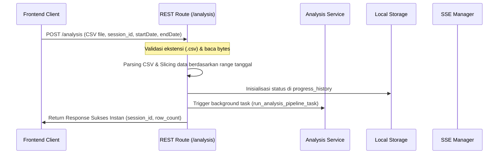
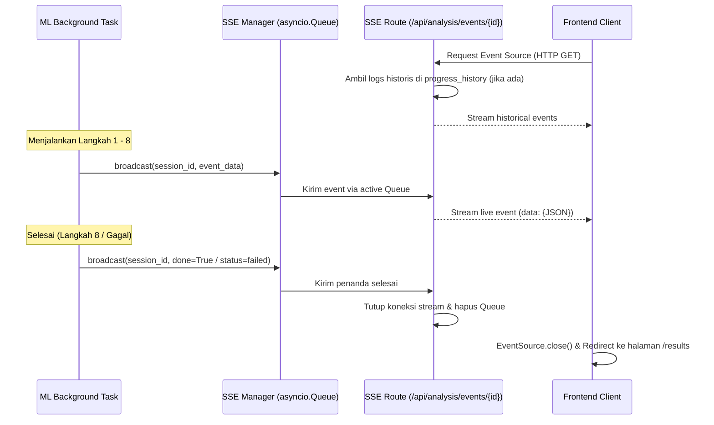

# ChatAnalisis API (Backend)

FastAPI backend untuk analisis dan pemrosesan chat WhatsApp sederhana dengan integrasi Machine Learning (BERTopic & NLP).

---

## 1. Arsitektur Folder (Clean Architecture)

Aplikasi ini menggunakan pola **Clean Architecture** untuk memisahkan tanggung jawab (separation of concerns) sehingga kode mudah dipelihara, diuji, dan diperluas:

```text
app/
├── api/                       <-- PRESENTATION LAYER (Routing)
│   └── routes/
│       └── analysis.py        <-- HTTP Endpoint (REST) dan Server-Sent Events (SSE) router
├── services/                  <-- APPLICATION LAYER (Business Use Cases)
│   └── analysis_service.py    <-- Orchestration background pipeline, formatting, dan logika bisnis utama
├── infrastructure/            <-- ADAPTERS LAYER (Storage & Events)
│   ├── storage.py             <-- Adapter untuk manipulasi file ke local filesystem (direktori storage/)
│   └── sse.py                 <-- Broadcast manager untuk Server-Sent Events dan progress tracker
├── utils/                     <-- PURE DOMAIN-AGNOSTIC CALCULATIONS (Helpers)
│   ├── preprocessing.py       <-- Tokenisasi, stopword removal, slang conversion, dan Sastrawi stemming
│   ├── topic_modeling.py      <-- Parameter UMAP, BIRCH clustering, dan kustomisasi c-TF-IDF (BM25)
│   ├── daily_graph.py         <-- Perhitungan aktivitas harian chat
│   └── leaderboard.py         <-- Perhitungan leaderboard pengirim teraktif
├── schemas.py                 <-- DTOs & Validation (Pydantic models untuk request & response)
├── config.py                  <-- Global configurations & Environment settings loader
└── main.py                    <-- App factory, middleware (CORS), dan global exception handlers
```

---

## 2. Alur Data & Eksekusi (Flows)

Aplikasi berjalan secara asinkronus menggunakan **Background Tasks** untuk menghindari HTTP Timeout ketika melakukan pemodelan topik ML yang berat.

### A. Alur Unggah & Inisiasi Analisis (Upload & Ingestion Flow)


### B. Alur Pemrosesan NLP & Machine Learning (ML Pipeline Flow)
Di dalam background thread (`run_analysis_pipeline_task`):
1. **Langkah 1 (Save Raw)**: Menyimpan salinan file CSV asli ke `storage/{session_id}.csv`.
2. **Langkah 2 (Preprocessing)**: Melakukan text-cleaning (emoji removal, case-folding, stopword removal, dan stemming).
3. **Langkah 3 (Embeddings)**: Memanggil model **IndoBERTweet** via `SentenceTransformer` untuk mengonversi teks menjadi vektor.
4. **Langkah 4 (UMAP)**: Mereduksi dimensi vektor embedding.
5. **Langkah 5 (BIRCH)**: Melakukan pengklasteran topik (clustering) berdasarkan vektor dimensi rendah.
6. **Langkah 6 (c-TF-IDF / BM25)**: Mengekstrak kata kunci representatif dari masing-masing klaster topik.
7. **Langkah 7 (Evaluasi)**: Menghitung NPMI, Topic Diversity, Embedding Density, dan Intra-topic Similarity.
8. **Langkah 8 (Save Results)**:
   * Menyimpan metadata hasil analisis ke `storage/{session_id}_result.json`.
   * Menyimpan data chat berlabel topik ke `storage/{session_id}_labeled.csv`.

### C. Alur Progress Tracker (SSE Flow)


---

## 3. Quick Start

### 1. Prasyarat
- Python 3.11+
- Virtual Environment tool (`venv`)

### 2. Jalankan Lokal

```bash
# Buat virtual environment
python3 -m venv venv
source venv/bin/activate

# Install dependensi
pip install -r requirements.txt

# Salin env file
cp .env.example .env

# Jalankan server dengan hot-reload
uvicorn app.main:app --reload
```

Server akan berjalan secara default di `http://127.0.0.1:8000`.

---

## 4. Dokumentasi API

Lihat [API.md](docs/API.md) untuk detail skema dan format response lengkap dari endpoint `/analysis`, `/api/results/{jobId}`, dan `/api/results/{jobId}/topics/{topicId}`.
